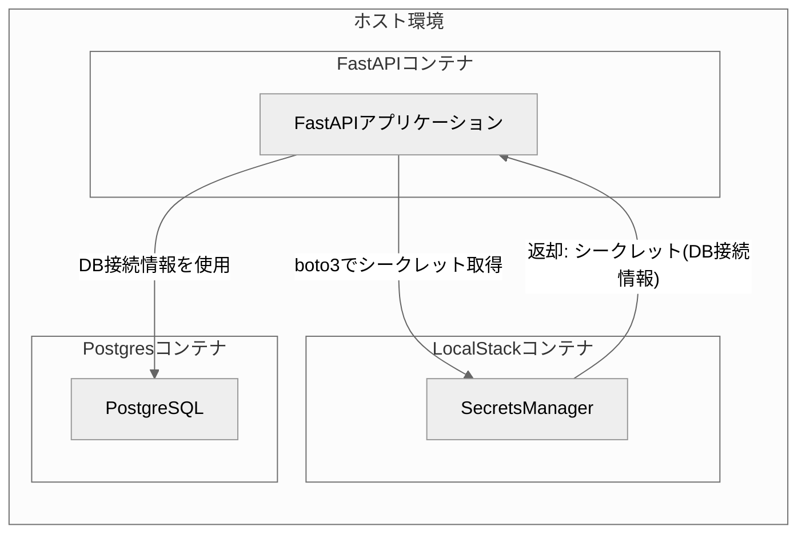
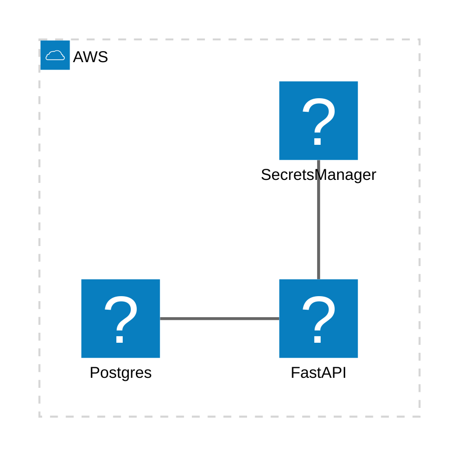

# fastapi_postgres_secretsmanager

## コンテナ構成イメージ


```mermaid
%%{init: {'theme': 'neutral'}}%%
flowchart LR
    subgraph Host["ホスト環境"]
        subgraph FastAPI["FastAPIコンテナ"]
            APP["FastAPIアプリケーション"]
        end

        subgraph LocalStack["LocalStackコンテナ"]
            SECRETS["SecretsManager"]
        end

        subgraph DB["Postgresコンテナ"]
            POSTGRES["PostgreSQL"]
        end
    end

    APP -->|"boto3でシークレット取得"| SECRETS
    APP -->|"DB接続情報を使用"| POSTGRES
    SECRETS -->|"返却: シークレット(DB接続情報)"| APP
```

## AWS 上での構築イメージ


```mermaid
%%{init: {'theme': 'neutral'}}%%
architecture-beta
    group  system(cloud)[AWS]
    service ec2(logos:aws-ec2)[FastAPI] in system
    service rdb(logos:aws-rds)[Postgres] in system
    service secrets(logos:aws:arch-aws-secrets-manager)[SecretsManager] in system


    ec2:L -- R:rdb
    ec2:T -- B:secrets

```

## 起動方法

```shell
docker compose up --build
```
